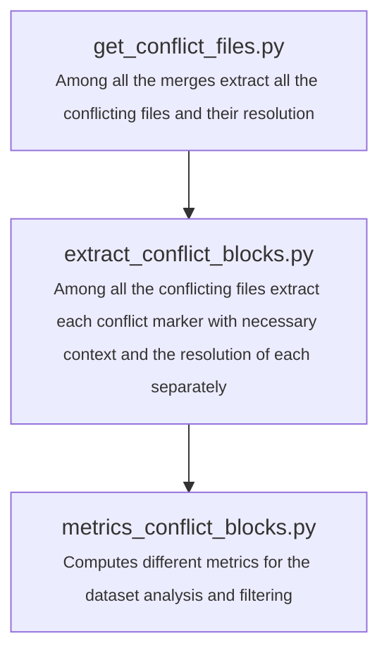

# LLMerge


## Installation

Install uv following this [guide](https://docs.astral.sh/uv/getting-started/installation/#standalone-installer) or simply use this quick command:

```bash
pip install uv
```

Install all dependencies and activate the venv with the following command:

```bash
uv sync
source .venv/bin/activate
```

## Faster dataset construction with GIL-Free Python

The dataset building part relies on multithreading which is slowed down by the Python GIL.
To bypass the GIL use the latest GIL free Python version.
To install GIL free Python run:

```bash
uv venv gil_free_venv --python 3.12t
source gil_free_venv/bin/activate
uv pip install -r requirements_dataset_building.txt
```

With this environment you can *only* run the dataset creation scripts since the latest libraries don't properly support this version of python yet.
You can now run:

```bash
PYTHON_GIL=0 ./build_dataset_small.sh
```


## Usage

### Run small example

```bash
./build_dataset_small.sh
```

### Official Training Procedure

The official training consists of two consecutive steps:

**Step 1** – Train for 1500 epochs with a learning rate of 5e-5:
```bash
python3 train.py --epochs 1500 --learning_rate 5e-5
```

**Step 2** – Resume training from checkpoint with 2000 more epochs at a reduced learning rate of 1e-5:
```bash
python3 train.py --epochs 2000 --learning_rate 1e-5 --resume
```

## Test set construction

```bash


## Code Structure


